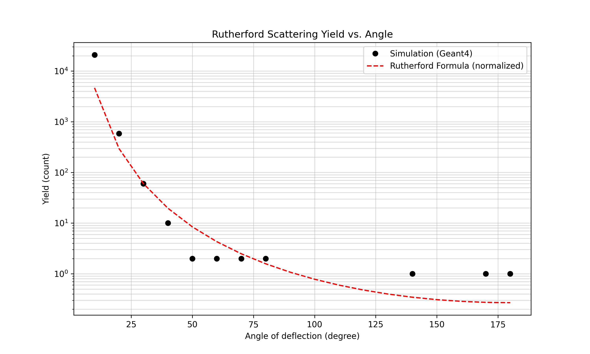

# Rutherford's Experiment in Geant-4

Code for replicating the study described in `doc.pdf`, **Study of Rutherford Scattering Cross Section via Geant4 Methods** by **Rachanee Rujiwarodom**, **Burin Asavapibhop** and **Pat Sangpeng**. This project is part of the course PHT-106 (Charge Particle Spectroscopy) offered by the Department of Physics at IIT Roorkee.

## Building the Project

Ensure you have Geant4 installed and sourced.

```bash
mkdir -p build
cd build
cmake ..
make -j$(nproc)
```

## Running the Simulation

### Batch Mode
To run the simulation with 1,000,000 events and output counts to the terminal:
```bash
./build/rutherford run1.mac
```

### Interactive Mode (Visualization)
To open the GUI and visualize the experiment:
```bash
./build/rutherford
```
Once the session starts, run particles using:
```bash
/run/beamOn 10
```

## Results

The simulation successfully replicates the angular dependence of the scattering yield. 



### Generating Plots
A Python script is provided to automate running the simulation and plotting the results against the theoretical Rutherford formula.
```bash
python3 plot_results.py
```

## Project Structure
- `src/`, `include/`: Simulation source code (snake_case convention).
- `run1.mac`: Macro for high-statistics run.
- `init_vis.mac`, `vis.mac`: Visualization configuration.
- `plot_results.py`: Data analysis and plotting script.
